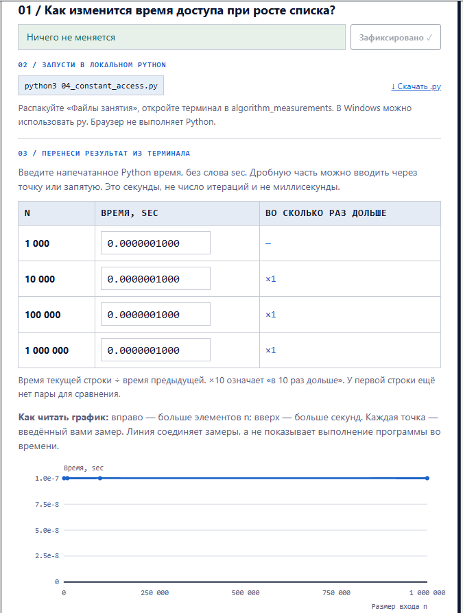
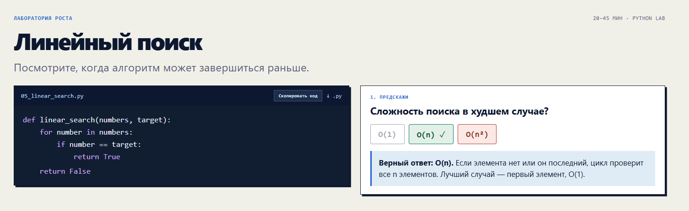
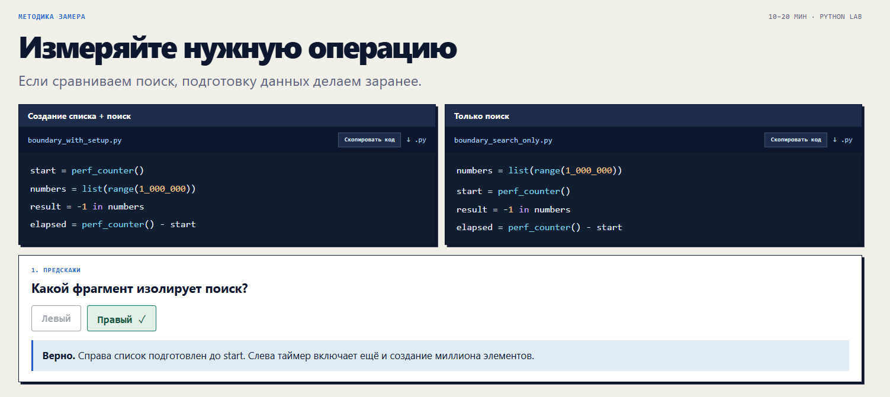
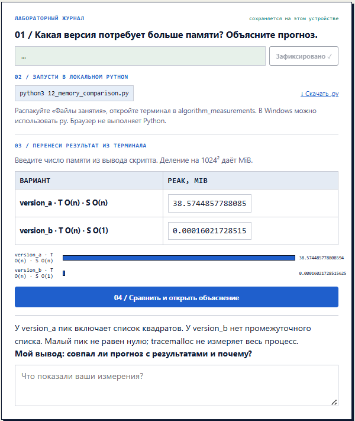
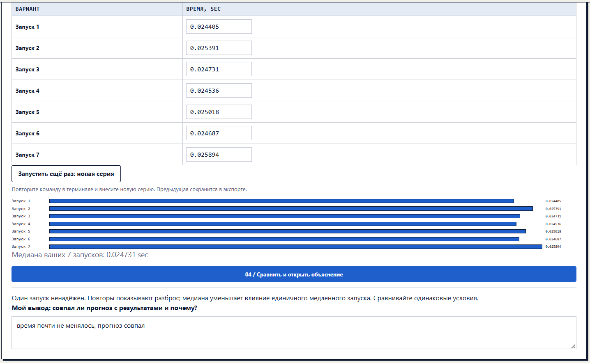
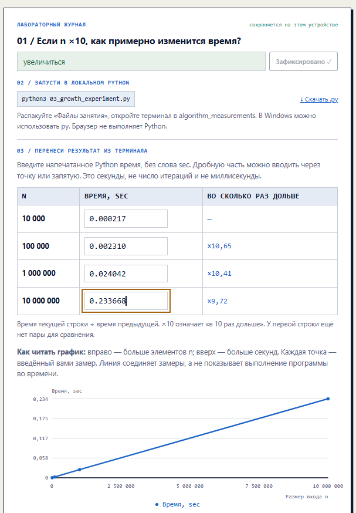
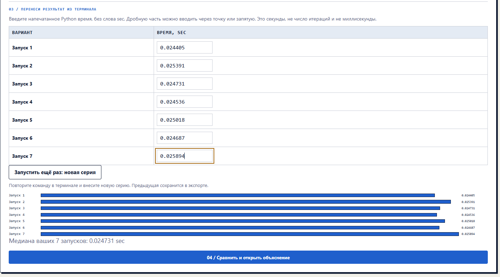
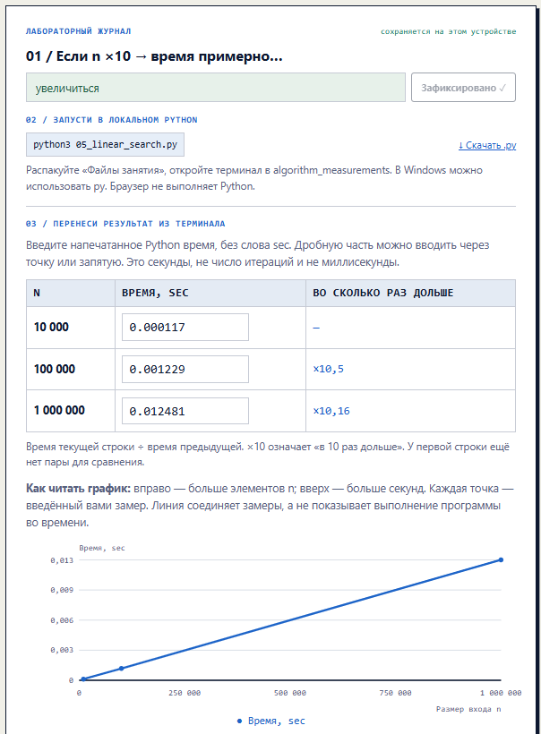
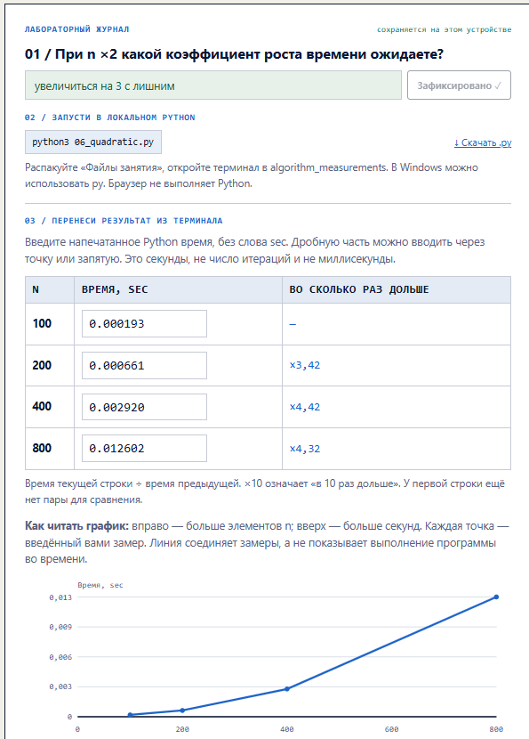
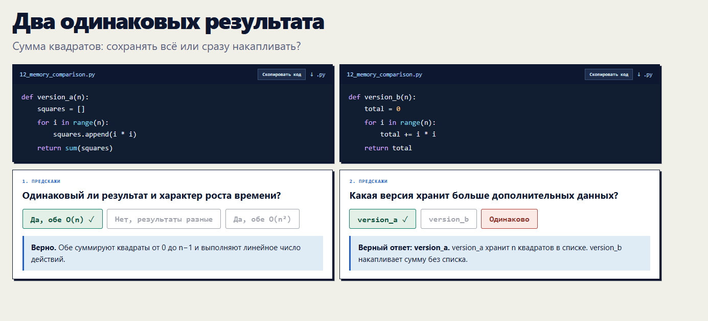

# Лабораторный журнал: Анализ сложности алгоритмов

В данной работе представлены результаты практических измерений временной и пространственной сложности различных алгоритмов.

## Пример 1: Доступ к элементу списка по индексу (Константное время)

**Что измерялось:** 
Время доступа к среднему элементу списка по известному индексу при увеличении общего размера списка (от 1 000 до 1 000 000 элементов).

**Полученный результат:** 
При увеличении размера списка в 10, 100 и 1000 раз время выполнения операции не изменилось и составило ~0.000001000 сек во всех случаях. График представляет собой прямую горизонтальную линию.

**Вывод:** 
Доступ к элементу списка по индексу выполняется за константное время — $O(1)$. Операция не требует перебора элементов, поэтому её скорость не зависит от размера структуры данных.

---

## Пример 2: Линейный поиск (Линейное время)

**Что измерялось:** 
Время выполнения алгоритмов с линейной сложностью (на примере линейного поиска) при увеличении размера входа $n$ в 10 раз.

**Полученный результат:** 
При увеличении количества элементов с 10 000 до 100 000 время выросло примерно в 10,5 раз (с 0.000117 до 0.001229 сек). При дальнейшем увеличении до 1 000 000 элементов время выросло еще в 10,16 раз (до 0.012481 сек). График имеет вид диагональной прямой.

**Вывод:** 
Время выполнения алгоритма растет прямо пропорционально количеству элементов $n$. Это наглядно подтверждает линейную временную сложность алгоритма — $O(n)$.

---

## Пример 3: Квадратичный рост 

**Что измерялось:** 
Изменение времени выполнения алгоритма при увеличении размера входа $n$ ровно в 2 раза (от 100 до 800 элементов).

**Полученный результат:** 
Каждое удвоение размера входа (например, с 200 до 400 или с 400 до 800) приводило к увеличению времени выполнения более чем в 4 раза (коэффициенты x4,42 и x4,32). График принимает форму параболы, резко уходящей вверх.

**Вывод:** 
Время выполнения растет пропорционально квадрату от количества элементов. Это классическое поведение алгоритмов с квадратичной сложностью — $O(n^2)$.

---

## Пример 4: Сравнение потребления памяти (Пространственная сложность)

**Что измерялось:** 
Объем потребляемой оперативной памяти (в MiB) двумя версиями алгоритма: `version_a` (сохраняет все квадраты в список) и `version_b` (накапливает итоговую сумму на лету).

**Полученный результат:** 
Версия алгоритма, сохраняющая данные в массив (`version_a`), в пике потребила 38.57 MiB памяти. Оптимизированная версия (`version_b`) потребовала всего 0.00016 MiB, что в сотни тысяч раз меньше.

**Вывод:** 
Отказ от хранения промежуточных результатов в дополнительных структурах данных (таких как списки) позволяет снизить пространственную сложность с $O(n)$ до константной $O(1)$, радикально экономя оперативную память без потерь во времени выполнения.

---

## Пример 5: Методика замеров и влияние погрешности

**Что измерялось:** 
Разброс времени выполнения одного и того же участка кода в серии из 7 запусков, а также важность изоляции таймера от этапа подготовки данных.

**Полученный результат:** 
Время выполнения варьировалось от 0.024405 до 0.025894 сек. Единичные запуски показали нестабильность из-за фоновой нагрузки ОС, однако медиана 7 запусков составила точные 0.024731 сек. 

**Вывод:** 
Для получения достоверных метрик таймер (perf_counter) должен охватывать только сам исследуемый алгоритм, исключая создание массивов и подготовку данных. Из-за влияния системных процессов одиночные замеры ненадежны — необходимо проводить серию тестов и использовать медианное значение.